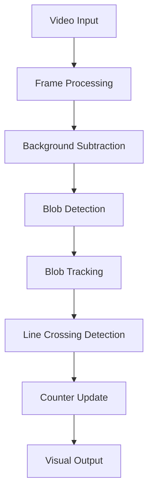

# People Counting System 👥 

A computer vision-based people counting system that tracks and counts people moving across a reference line in a video feed. The system uses OpenCV for image processing and blob tracking to detect and count people moving in both directions.

## Features 🌟

- 🎯 Real-time people counting in both directions (in/out)
- 📦 Visual tracking of detected people with bounding boxes
- ⚡ Reference line crossing detection
- 🔄 Background subtraction for motion detection
- 🎯 Blob tracking with predictive movement
- 📊 Visual feedback with on-screen counters

## Tech Stack 🛠️


## Technical Details 🔍

### Prerequisites ✅

- OpenCV (with C++ support)
- CMake
- C++ compiler

### Key Components 🔧

1. **Blob Detection and Tracking** 🎯
   - Background subtraction using MOG2
   - Contour detection and filtering
   - Convex hull computation for better blob representation
   - Blob tracking across frames with predictive positioning

2. **Image Processing Pipeline** 🖼️
   - Gaussian blur for noise reduction
   - Background subtraction
   - Binary thresholding
   - Morphological operations (erosion and dilation)

3. **Counting Logic** 🧮
   - Reference line positioned at 60% of frame height
   - Tracks blob center positions
   - Counts direction based on line crossing
   - Visual feedback with color-changing reference line

### Building the Project 🏗️

```bash
cmake .
make
```

## Usage 📝

The program takes a video file as input and processes it frame by frame. To run:

```bash
./DisplayVideo
```

The system will display:
- 🖥️ Main window with tracking visualization
- 📊 Count of people moving in both directions
- 🚦 Visual feedback when people cross the reference line

## Configuration ⚙️

Key parameters that can be adjusted:
- 🎛️ Background subtractor parameters (history: 3000, threshold: 128)
- 📏 Blob detection thresholds:
  - Minimum area: 1500 pixels
  - Aspect ratio range: 0.6 to 4.0
  - Minimum width/height: 25 pixels
  - Minimum diagonal size: 60.0 pixels

## Implementation Details 💻

- ⚡ Uses OpenCV's background subtractor (MOG2)
- 🔄 Implements custom blob tracking algorithm
- 🎯 Real-time processing and visualization
- 🔍 Frame-by-frame analysis with option for debug mode

## Architecture 🏛️



## License 📄

This project is available under the MIT License.

## Credits 👨‍💻

Created by Abhijith BN

---
<div align="center">
Made with ❤️ and Computer Vision
</div>